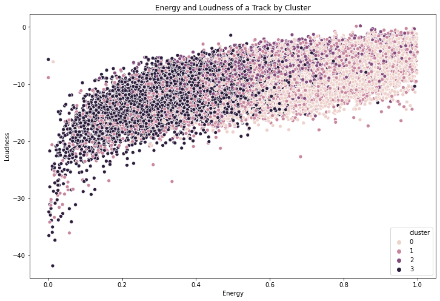

# Pop_Genres_Analysis

This project attempts to define the different subgenres of pop music and group music tracks appropriately based on these defined subgenres. The base dataset was found on [Kaggle](https://www.kaggle.com/yamaerenay/spotify-dataset-19212020-160k-tracks) and supplemented with genre data retrieved using the Spotify API. Because Spotify does not provide genre labels for a music track, unsupervised machine learning methods were used--particularly, clustering. The goal of this project was to help improve Spotify's reccomendation system by attaching labels to music tracks and help music enthusiasts dive deep into the different sounds of pop music.

# Structure
  * **00.Prework**: Data preparation
  * **01.Initial_Models**: Initial models ran, specifically hierarchical clustering and k-means
  * **02.KMedoids_Models**: Clustering using Gower Distance and K-Medoids, the best model was created here
  * **03.KMedoids_Analysis**: Analysis of the best model and resulting clusters
  * **04.Subclustering**: Attempt to make resulting clusters more granular
  * **05.Final_Visualizations_and_Playlists**: More consistent visuals and playlists for each cluster
  
# Models
Initially, hierarchical clustering and k-means were used to form the clusters. However, these resulted in poor results. This was because of the mix of numeric and categorical features in the dataset. Upon realizing this, a combination of Gower Distance and K-Medoids was used to cluster the data. The best model had 4 clusters, a silhouette score of 0.22 and a variance ratio of 10,483.23. After these clusters were formed, I attempted to create subclusters out of them, but the results were not very good. The models were very unstable and their variance ratios and silhoette scores were very low. The added clusters did make the results better and sometimes made the results worse. In the end, 4 clusters were chosen for simplicity.

# Cluster EDA

The above is the cluster distribution. Cluster 0 was the largest cluster and made up of the most tracks. Cluster 2 was the smallest. Cluster 1 and Cluster 3 were about the same size.

There is a strong positive correlation between the energy and loudness of a track. Further we can see that clusters were form around this relationship. Cluster 0 is the most loud and energetic on average and Cluster 3 is least. Cluster 1 and Cluster 2 fall in somewhere in between. 

There is a moderate negative correlation between acousticness and energy. We can see that Cluster 3 is the most acoustic while Cluster 0 is the least. Cluster 1 and Cluster 2 fall in between again. 

Cluster 2 has the highest proportion of explicit tracks. Further, the tracks in Cluster 2 were more speechy on average. Cluster 2 was the smallest group but best defined: it consists primarily of rap and hip-hop tracks and their derivatives.

Cluster 1 had the lowest proportion of tracks on a major scale. In other words, the majority of tracks in Cluster 1 employed a minor scale. This was what made Cluster 2 distinct from the others. 

# Conclusions
Unfortanetly, I was unable to get more granular results than the four clusters defined above. In the end, I was unsuccessful in defining the different subgenres of pop music and grouping tracks accordingly. I believe the primary reason for this was that data was inadequate for the task. It was too general to give me the granularity I was looking for. Because of this, different sounding genres can end up with the same values for certain features (like valence or energy).

However, what I was able to create were very interesting track mixes. While the genres varied greatly within each cluster, the overall mood and vibe of each cluster was fairly consistent. This can be used as a recommendation system. It can look at a users saved tracks and created mixes for them. The playlists formed this way will generally have songs of different genres but with a similar feeling and mood to them.

# Next Steps
The following are steps that can be taken to improve this project:
* **Try a different clustering algorith**, particularly K-prototypes which is supposed to handle mixed data well.
* **Use a more complex dataset.** I believe the dataset I used was inadequate for the task. It was too general for the level of granularity I wished to achieve. Besides Track Features, Spotify also has Audio Analysis data for each track. Perhaps this data is complex enough for the task at hand. It would also be interesting to use actual audio files to cluster tracks during the learning process. 

# Presentation Deck

[Presentation Deck](https://drive.google.com/file/d/1lwEP5wafLgKyCIqlS8cljqtuEcM0AwdH/view)

# Cluster Playlists
Below are four playlists that contain 50 songs from each cluster. 

[Cluster 0](https://open.spotify.com/playlist/629Jrefu0rNKh4mOhnYWWN?si=YShn70sSS3KOR4_TqrU56g)

[Cluster 1](https://open.spotify.com/playlist/6JENzX44x8FHQV43g5WpEy?si=a5WeCUN6R2qrZ8YLim3w8Q)

[Cluster 2](https://open.spotify.com/playlist/3dj735Sxd8EHFF3nFwwGgR?si=bGKEavedQnW0f2-Zxrra2g)

[Cluster 3](https://open.spotify.com/playlist/6ELhFjfvOzsAHVviqEbGBd?si=NNgLGUM6RnKzAUbxayehMA)

